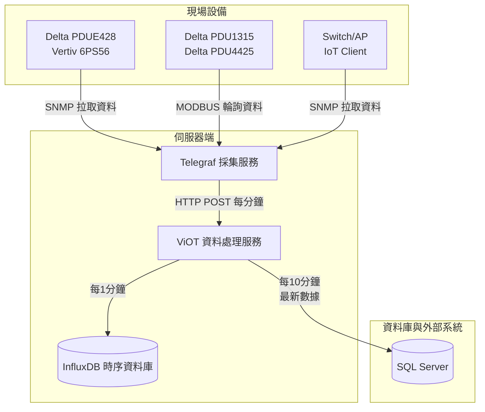
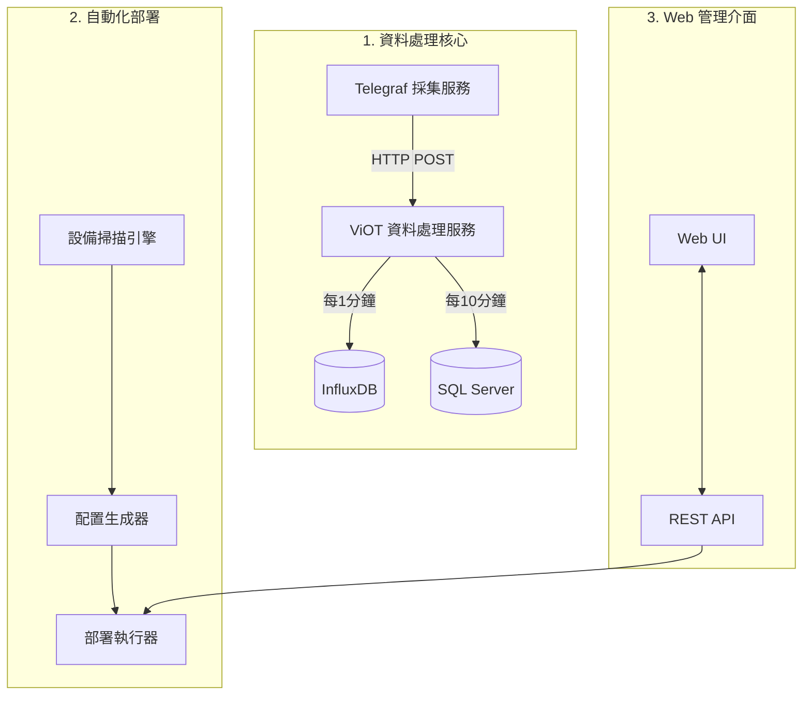

# viot - 機房 PDU 電力監控與資料處理平台

viot 是一個使用 Go 語言開發的高效能電力監控系統，專為資料中心或機房環境中的電力數據（電流、電壓、功率、能耗）採集與處理設計。系統分為三個主要模組：

1. **資料處理核心** - 負責數據採集、處理與儲存的核心服務
2. **自動化部署** - 設備掃描與 Telegraf 配置自動部署
3. **Web 管理介面** - 提供部署配置與監控管理的使用者介面

## 🛠️ 資料處理架構



## 系統架構

系統架構清晰分為三個主要部分，可獨立運作亦可整合使用：



## 1️⃣ 資料處理核心

### 核心功能

- **數據接收與處理**

  - Telegraf 數據接收與解析 ✅
  - 數據單位轉換與標準化 ✅
  - 標籤管理與匹配 ✅

- **多重儲存後端**

  - InfluxDB 時序數據儲存 ✅
  - SQL Server 關聯數據儲存 ✅
  - 本地 CSV 備份機制 ✅

- **錯誤處理機制**
  - 數據完整性驗證 ✅
  - 自動重試機制 ✅
  - 備份與回補機制 ✅

### 資料處理 API

| API 端點               | 方法 | 功能描述           | 狀態      |
| ---------------------- | ---- | ------------------ | --------- |
| `/api/telegraf/data`   | POST | 接收 Telegraf 數據 | ✅ 已實作 |
| `/api/telegraf/metric` | POST | 接收 Telegraf 指標 | ✅ 已實作 |
| `/api/telegraf/stats`  | GET  | 獲取採集器統計資訊 | ✅ 已實作 |

## 2️⃣ 自動化部署

### 核心功能

- **設備掃描引擎**

  - 網段掃描模塊（基於`ip_range.csv`設定）✅
  - 設備識別與分類機制 ✅
  - 掃描任務調度器（支援設定時間間隔和持續時間）✅

- **設備檢測與驗證模塊**

  - SNMP 檢測功能（端口 161）✅
  - Modbus 檢測功能（端口 502）✅
  - 設備類型識別邏輯（基於 OID 或寄存器）✅

- **設備匹配引擎**

  - 基於`config.yaml`的設備匹配邏輯 ✅
  - 製造商/型號識別機制 ✅
  - 協議自動選擇（SNMP/Modbus）✅

- **部署配置生成器**

  - Telegraf 配置模板處理 ✅
  - 動態配置生成與測試 ✅
  - 配置測試驗證（`telegraf --test config.conf`）✅

- **掃描功能測試**
  - SNMP 設備掃描模擬測試 ✅
  - Modbus 設備掃描模擬測試 ✅
  - IP 範圍掃描模擬測試 ✅
  - 自動化測試覆蓋率 ✅

### 自動化部署 API

| API 端點                  | 方法 | 功能描述     | 狀態      |
| ------------------------- | ---- | ------------ | --------- |
| `/api/scan`               | POST | 開始掃描     | ✅ 已實作 |
| `/api/scan/status`        | GET  | 獲取掃描狀態 | ✅ 已實作 |
| `/api/scan/stop`          | POST | 停止掃描     | ✅ 已實作 |
| `/api/devices`            | GET  | 獲取設備列表 | ✅ 已實作 |
| `/api/devices/:ip/deploy` | POST | 部署指定設備 | ✅ 已實作 |

## 3️⃣ Web 管理介面

### 核心功能

- **PDU 監控視圖**

  - 動態 PDU 佈局顯示 ✅
  - 狀態顏色標示 (監控/未監控) ✅
  - 支援旋轉視圖 (0°/90°/180°/270°) ✅
  - 網格/表格視圖切換 ✅

- **設備管理**
  - PDU 部署確認對話框 ✅
  - 標籤編輯功能 ✅
  - 房間選擇器 ✅

### Web UI API

| API 端點                    | 方法 | 功能描述      | 狀態      |
| --------------------------- | ---- | ------------- | --------- |
| `/api/pdu`                  | GET  | 獲取 PDU 數據 | ✅ 已實作 |
| `/api/pdu/:pdu_name/status` | PUT  | 更新 PDU 狀態 | ✅ 已實作 |
| `/api/pdu/:pdu_name/tags`   | GET  | 獲取 PDU 標籤 | ✅ 已實作 |
| `/api/pdu/:pdu_name/tags`   | PUT  | 更新 PDU 標籤 | ✅ 已實作 |
| `/api/rack`                 | GET  | 獲取設備數據  | ✅ 已實作 |
| `/api/rooms`                | GET  | 獲取房間列表  | ✅ 已實作 |

## 目錄結構

```bash
viot/
├── api/                   # API 層
│   ├── controller/        # API 控制器
│   ├── middleware/        # 中間件
│   ├── response/         # 響應處理
│   └── router/           # 路由定義
├── architecture/          # 架構文檔
│   └── arch.md           # 架構設計文檔
├── cmd/                   # 命令入口
│   └── main.go           # 主程序入口
├── config/               # 配置管理
│   └── config.go         # 配置處理邏輯
├── interfaces/           # 介面定義
│   └── interfaces.go     # 核心介面定義
├── logger/              # 日誌處理
│   └── logger.go        # 日誌處理邏輯
├── models/              # 數據模型
│   └── models.go        # 核心數據模型
├── pkg/                 # 公共套件
│   ├── collector/       # 數據採集器
│   │   ├── core/       # 核心採集邏輯
│   │   ├── inputs/     # 輸入源處理
│   │   ├── wrapper/    # 包裝器
│   │   └── config.go   # 採集配置
│   ├── deployer/        # 部署管理
│   │   ├── deployer.go        # 部署器介面
│   │   └── telegraf_deployer.go # Telegraf 部署實現
│   ├── manager/         # 系統管理
│   ├── output/          # 輸出處理
│   ├── process/         # 進程管理
│   ├── processor/       # 數據處理器
│   │   ├── base_processor.go   # 基礎處理器
│   │   ├── pdu_processor.go    # PDU 數據處理
│   │   ├── telegraf_processor.go # Telegraf 數據處理
│   │   ├── manager.go          # 處理器管理
│   │   └── output_router.go    # 輸出路由
│   ├── scanner/         # 設備掃描
│   │   ├── scanner.go          # 掃描器介面
│   │   ├── modbus_scanner.go   # Modbus 掃描
│   │   ├── snmp_scanner.go     # SNMP 掃描
│   │   ├── device_identify.go  # 設備識別
│   │   ├── scan_manager.go     # 掃描管理
│   │   └── ip_utils.go         # IP 工具
│   ├── utils/          # 工具函數
│   └── webservice/      # Web 服務
├── storage/             # 存儲層
│   ├── csv/            # CSV 存儲
│   ├── influxdb/       # InfluxDB 存儲
│   ├── recovery/       # 數據恢復
│   └── interface.go    # 存儲介面定義
├── yamls/              # YAML 配置文件
│   ├── config.yaml     # 系統配置
│   └── devices.yaml    # 設備配置
├── .specstory/         # 規格文檔
├── go.mod              # Go 模組定義
├── go.sum              # Go 依賴版本鎖定
├── arch.md             # 架構文檔
└── pdu_list.csv        # PDU 設備列表
```

## 核心模組說明

### 1. 數據採集器 (collector)

數據採集器負責從各種設備收集數據，支持多種協議和數據源：

- **核心組件**
  - `core/input_manager.go`: 輸入插件管理器
  - `core/device_input.go`: 設備輸入基類
  - `core/interface.go`: 接口定義

- **輸入插件**
  - `inputs/modbus_collector.go`: Modbus 協議收集器
  - `inputs/snmp_collector.go`: SNMP 協議收集器
  - `inputs/telegraf_collector.go`: Telegraf 數據收集器

- **功能特點**
  - 支持多種協議（SNMP、Modbus、Telegraf）
  - 自動設備發現和配置
  - 統一的數據收集介面
  - 可擴展的插件架構

### 2. 數據處理器 (processor)

負責處理和轉換採集到的數據：

- **核心組件**
  - `base_processor.go`: 基礎處理器介面
  - `pdu_processor.go`: PDU 專用數據處理
  - `telegraf_processor.go`: Telegraf 數據處理
  - `manager.go`: 處理器管理
  - `output_router.go`: 輸出路由

- **功能特點**
  - 數據格式標準化
  - 多輸出目標支持
  - 數據驗證和過濾
  - 錯誤處理和重試

### 3. 設備掃描器 (scanner)

負責設備發現和識別：

- **核心組件**
  - `scanner.go`: 掃描器介面
  - `modbus_scanner.go`: Modbus 設備掃描
  - `snmp_scanner.go`: SNMP 設備掃描
  - `device_identify.go`: 設備識別邏輯
  - `scan_manager.go`: 掃描任務管理
  - `ip_utils.go`: IP 範圍處理

- **功能特點**
  - 多協議設備發現
  - 自動設備類型識別
  - 並發掃描支持
  - IP 範圍管理

### 4. 部署管理器 (deployer)

負責設備配置和部署：

- **核心組件**
  - `deployer.go`: 部署器介面
  - `telegraf_deployer.go`: Telegraf 配置部署

- **功能特點**
  - Telegraf 配置生成
  - 自動化部署流程
  - 配置驗證
  - 部署狀態追踪

### 5. 存儲層 (storage)

提供多種數據存儲方案：

- **存儲實現**
  - `csv/`: CSV 文件存儲
  - `influxdb/`: InfluxDB 時序數據庫
  - `recovery/`: 數據恢復機制

- **功能特點**
  - 多種存儲後端支持
  - 數據備份和恢復
  - 統一的存儲介面
  - 數據一致性保證

## 啟動方式

### 安裝依賴

```bash
# 安裝依賴
go mod tidy
```

### 準備配置

在 `conf` 目錄下確保有以下配置文件：

1. `config.yaml`: 系統主配置文件
2. `devices.yaml`: 設備配置文件
3. `telegraf.conf`: Telegraf 基礎配置

### 啟動服務

```bash
# 啟動服務
go run cmd/main.go

# 只啟動資料處理核心
go run cmd/main.go --mode=core

# 使用自定義配置啟動服務
go run cmd/main.go --config=/path/to/config.yaml

# 使用自定義 PDU 和設備狀態文件路徑
go run cmd/main.go --pdu-status=/path/to/pdu_status.csv --device-status=/path/to/device_status.csv

# 設置狀態同步間隔
go run cmd/main.go --sync-interval=5m
```

服務啟動後，訪問 http://localhost:8080 即可使用系統。
