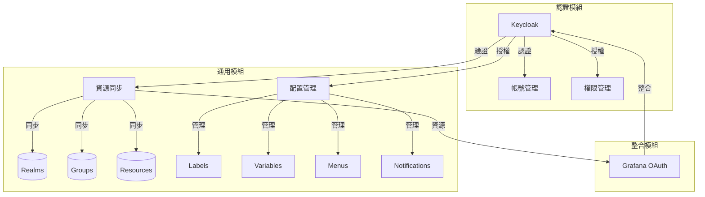

# Tools SDK

軟體開發套件 (SDK)，提供了一系列標準化的開發工具和介面，用於簡化和統一各產品開發專案的實現。

## 特點

- 標準化的 API 介面
- 完整的身份驗證和授權功能
- 統一的錯誤處理機制
- 豐富的使用示例
- 版本化的發布管理
- 模組化設計，支援跨產品共用

## 目標

- 提供統一的代碼實現標準
- 減少重複開發工作
- 確保各專案間的一致性
- 提高代碼質量和可維護性
- 促進模組重用和共享

## 模塊

### Auth 模組
認證相關模塊，提供統一的身份驗證和授權功能。

#### Keycloak
已完成：
- [x] Client 初始化
- [x] 用戶信息驗證
- [x] 角色管理

進行中：
- [ ] 群組管理
- [ ] 選單管理
- [ ] RBAC 權限管理

### General 模組
通用基礎模組，提供跨產品共用的功能。

#### 資源同步
- [ ] Realms 同步管理
- [ ] Groups 同步管理
- [ ] Resources 同步管理

#### 配置管理
- [ ] 自定義標籤系統
- [ ] 自定義變數管理
- [ ] 群組選單配置
- [ ] 通知模板管理
- [ ] 通知規則管理
- [ ] 資料來源管理

#### Logger
- [ ] 統一日誌格式
- [ ] 日誌級別管理
- [ ] 日誌輸出配置

#### Config
- [ ] 配置文件管理
- [ ] 環境變數處理
- [ ] 動態配置更新

### 整合模組

#### Grafana OAuth
- [ ] 驗證機制
- [ ] 授權管理
- [ ] 權限控制

### 規劃中

#### License 
- [ ] 授權驗證
- [ ] 功能控制
- [ ] 使用者管理

## 架構設計

### 系統流程


### 模組化結構
```
shared-lib/
├── general/           # 通用基礎模組
│   ├── sync/         # 資源同步
│   ├── config/       # 配置管理
│   └── notification/ # 通知系統
└── auth/             # 認證授權
    └── keycloak/     # Keycloak 實現
```


## 安裝

```bash
go get github.com/zoelin2022/shared-lib
```

### 版本管理

在 GitLab 倉庫的 Tags 頁面查看：
[https://github.com/zoelin2022/shared-lib/-/tags](https://github.com/zoelin2022/shared-lib/-/tags)

使用特定版本：
```bash
go get github.com/zoelin2022/shared-lib@v0.1.0
```

使用最新版本：
```bash
go get github.com/zoelin2022/shared-lib@latest
```

在 go.mod 中指定版本：
```
require github.com/zoelin2022/shared-lib v0.1.0
```

> 注意：建議在生產環境中使用固定版本號，避免使用 `@latest` 標籤。

### 版本發布規則

我們遵循語義化版本 (Semantic Versioning)：
- 主版本號 (MAJOR)：不兼容的 API 修改
- 次版本號 (MINOR)：向下兼容的功能性新增
- 修訂號 (PATCH)：向下兼容的問題修正

## 使用方式

每個模塊都提供了完整的示例代碼，位於 `examples` 目錄下。例如：

- General 模組：`examples/general/main.go`
- Keycloak 認證：`examples/keycloak/main.go`

## 開發指南

### 目錄結構

```
shared-lib/
├── interfaces/     # 介面定義
├── general/       # 通用基礎模組
├── auth/         # 認證相關實現
│   └── keycloak/  
├── examples/      # 使用示例
└── ...           # 其他模塊
```

## 版本要求

- Go 1.21 或以上

## 貢獻指南

1. 所有新功能必須提供介面定義
2. 必須包含單元測試
3. 需要提供使用示例
4. 遵循公司代碼規範

## 注意事項

- 使用前請仔細閱讀相關模塊的介面定義
- 建議使用環境變數管理敏感配置
- 注意資源的正確釋放
- 遵循模組化設計原則